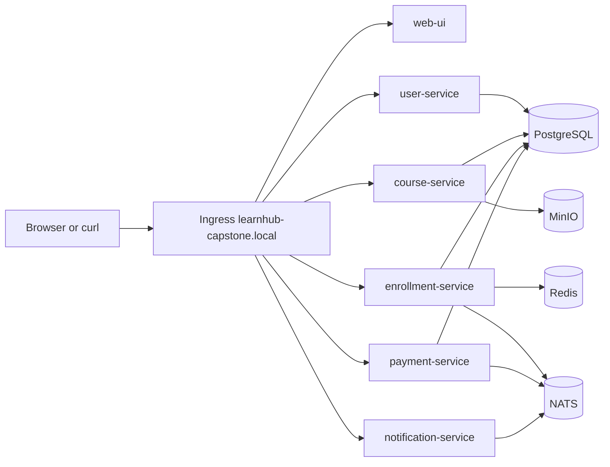

# LearnHub Architecture

## Service diagram

## Data flow

1. Hoc vien goi `user-service` de dang ky/dang nhap.
2. Hoc vien xem khoa hoc qua `course-service`.
3. Hoc vien tao thanh toan qua `payment-service`.
4. `payment-service` mo phong event `payment.completed` qua response va cau hinh NATS.
5. `enrollment-service` tao ghi danh va cap nhat tien do hoc.
6. `notification-service` mo phong gui email/thong bao.

## Kubernetes communication

- North-south: `Ingress` route `/`, `/courses`, `/students`, `/enrollments`, `/payments`, `/notifications`, `/platform` vao `web-ui`; API route `/api/users`, `/api/courses`, `/api/payments`, `/api/enrollments`, `/api/progress`, `/api/notifications`.
- Route `GET /api/users/{id}/courses` dung regex `/api/users/[^/]+/courses` vao `enrollment-service`, vi prefix `/api/users` con lai thuoc `user-service`.
- East-west: moi backend co `ClusterIP Service`, client trong namespace dung DNS ngan: `http://course-service`.
- Network isolation: `NetworkPolicy` default deny, chi allow ingress-nginx va Pod LearnHub noi bo vao cac port can thiet.
- Storage: PostgreSQL va MinIO dung PVC; `learnhub-proof-data` dung de demo persistence rieng.

## Multi-container pattern

`course-service-blue` va `course-service-green` dung:

- `initContainer init-runtime-config`: tao file runtime config trong `emptyDir`.
- `main`: Go service.
- `ambassador-proxy`: Nginx sidecar proxy traffic den main container.
- `log-tailer`: sidecar tail access/error log tu `emptyDir`.

Service `course-service` route vao sidecar proxy qua `targetPort: proxy-http`.
