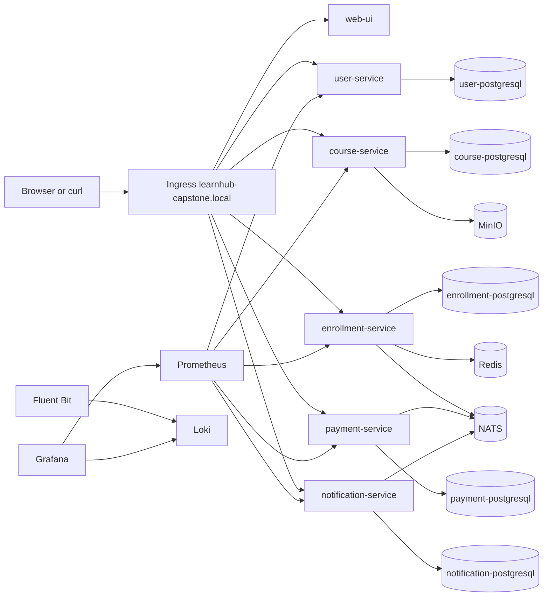

# LearnHub Architecture

## Service diagram

## Data flow

1. Hoc vien goi `user-service` de dang ky/dang nhap.
2. Hoc vien xem khoa hoc qua `course-service`.
3. Hoc vien tao thanh toan qua `payment-service`.
4. `payment-service` persist confirmation va `payment.completed` vao transactional outbox trong cung transaction.
5. Outbox worker publish event len NATS JetStream; durable `enrollment-service` consumer persist enrollment idempotent. Khi cap nhat progress, service ghi `lesson.completed` qua outbox va cache read model trong Redis.
6. `notification-service` consume ca hai event va persist notification queue.
7. `course-service` luu metadata content trong PostgreSQL va bytes video/tai lieu trong MinIO.

## Kubernetes communication

- North-south: `Ingress` route `/`, `/courses`, `/students`, `/enrollments`, `/payments`, `/notifications`, `/platform` vao `web-ui`; API route `/api/users`, `/api/courses`, `/api/payments`, `/api/enrollments`, `/api/progress`, `/api/notifications`.
- Route `GET /api/users/{id}/courses` dung regex `/api/users/[^/]+/courses` vao `enrollment-service`, vi prefix `/api/users` con lai thuoc `user-service`.
- East-west: moi backend co `ClusterIP Service`, client trong namespace dung DNS ngan: `http://course-service`.
- Network isolation: `NetworkPolicy` default deny; port PostgreSQL `5432` khong nam trong rule noi bo chung. Moi cap service/database chi duoc phep giao tiep khi cung label `learnhub.io/owner`.
- Storage: moi backend so huu mot PostgreSQL Deployment, ClusterIP Service, credential Secret va PVC `512Mi` rieng. MinIO, JetStream va `learnhub-proof-data` dung PVC rieng.
- Startup dependency: init container `wait-for-database` chay `psql SELECT 1`; container ung dung chi khoi dong khi DNS, network, credential va database deu hop le.
- Async: NATS JetStream tren port `4222` luu stream `LEARNHUB_EVENTS` tren PVC. Transactional outbox ngan dual-write loss; publisher dat `Nats-Msg-Id`; durable consumers explicit ack, retry va dung unique `event_id`/business key de xu ly at-least-once.
- Cache/object store: enrollment progress cache trong Redis 5 phut; course content upload/stream qua MinIO bucket `learnhub-content`.
- Observability: moi service expose Prometheus `/metrics` va JSON stdout log. Optional Kustomize stack dung Prometheus, Grafana, Loki va Fluent Bit node-level.

## Multi-container pattern

`course-service-blue` va `course-service-green` dung:

- `initContainer init-runtime-config`: tao file runtime config trong `emptyDir`.
- `main`: Go service.
- `ambassador-proxy`: Nginx sidecar proxy traffic den main container.
- `log-tailer`: sidecar tail access/error log tu `emptyDir`.

Service `course-service` route vao sidecar proxy qua `targetPort: proxy-http`.
